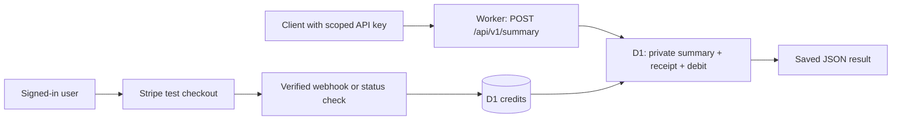

# Pay per request on Cloudflare

This example connects Google sign-in, Stripe test checkout, API keys, and the existing private D1 todos. A user buys 1,000 credits, creates a **Summary** key, and pays one credit for a database summary. Workers handles HTTP; D1 owns balances, receipts, and results. The same deployment also serves the free todos and private R2 examples.



## Try it

1. Follow [Google sign-in](google-sign-in.md) and [Stripe setup](payments.md), then run `pnpm dev`. No additional Cloudflare services or billing daemon are needed.
2. Sign in, add a few todos, and choose **Add credits**. Complete a test payment. The backend grants 1,000 credits only after verifying the paid session with Stripe. Refreshing the success page or receiving duplicate webhooks never grants another pack.
3. Create a key with **Summary · 1 credit** access. Copy it once.
4. Call the endpoint. Keep the same request ID when retrying this logical request:

```bash
export IDEA_API_KEY='paste-your-summary-key'
export IDEA_API_URL='http://localhost:3001' # or your deployed dashboard / API origin
REQUEST_ID=$(node -e 'console.log(crypto.randomUUID())')

curl -i "$IDEA_API_URL/api/v1/summary" \
  -H "Authorization: Bearer $IDEA_API_KEY" \
  -H "Idempotency-Key: $REQUEST_ID" \
  -H 'Content-Type: application/json' \
  -d '{"status":"all"}'
```

The body is `{ "summary": { "total": 2, "completed": 1, "open": 1 }, "status": "all" }` for one open and one completed todo. Optional `status` accepts `all` (default), `open`, or `completed`; counts reflect that filter. Unknown fields are rejected. The entire owner's dataset is counted, including rows beyond the free list endpoint's first 100 records.

Success headers:

| Header                 | Meaning                                           |
| ---------------------- | ------------------------------------------------- |
| `X-Request-Id`         | Stable receipt ID for this logical request        |
| `X-Credits-Charged`    | `1` for the initial result, `0` for a replay      |
| `X-Credits-Balance`    | Remaining balance when this transaction completed |
| `Idempotency-Replayed` | Whether the stored result was returned            |
| `X-RateLimit-*`        | The key's 30-per-minute limit, including retries  |

Run the **same curl command** again: it returns exactly the same body and receipt without spending another credit, even if the underlying todos changed or the balance reached zero. Generate a **new** `REQUEST_ID` for a fresh summary. Choose **Refresh balance** in the dashboard to see the debit. Deleting the key immediately prevents new requests and replays.

| Status                | Meaning / next step                                                       |
| --------------------- | ------------------------------------------------------------------------- |
| 400 / 415             | Invalid header, body, or content type; fix the input                      |
| 401                   | Missing, invalid, or revoked key                                          |
| 403                   | Wrong scope; free todo keys cannot spend credits                          |
| 402                   | Insufficient credits; top up, then retry the same request ID              |
| 409                   | A successful request already used this ID with another input or operation |
| 429                   | Rate limited; honor `Retry-After`, then retry the same ID                 |
| 5xx / lost connection | Retry with the same ID; a committed result will be replayed               |

Non-successful requests spend no credits. A lost HTTP response may still represent a committed request; reusing its ID is how the caller recovers safely. Insufficient-credit and invalid-input attempts do not reserve an ID. Idempotency is scoped to the user, shared across their authorized Summary keys, and persists for the lifetime of the receipt. Replays still require a valid scoped key and pass rate limiting.

## Backend map

| File                                                          | Responsibility                                                                                 |
| ------------------------------------------------------------- | ---------------------------------------------------------------------------------------------- |
| [`summary.ts`](../apps/api/src/summary.ts)                    | Scope check, input validation, server-selected price, private business query                   |
| [`billing.ts`](../apps/api/src/billing.ts)                    | Credit pack size, per-operation price, atomic charge and replay, account history               |
| [`checkout.ts`](../apps/api/src/checkout.ts)                  | Server-selected Stripe price, order snapshot, payment verification, one credit grant per order |
| [`keys.ts`](../apps/api/src/keys.ts)                          | Hashed keys, explicit single-endpoint scopes, revocation, rate limiting                        |
| [`0005_credits.sql`](../apps/api/migrations/0005_credits.sql) | Account balances, immutable grants/receipts, uniqueness and non-negative-balance constraints   |

`GET /api/billing` requires the user's session and returns `balance`, `summaryCost`, `packCredits`, and the latest ten grants/debits. API keys cannot read it or manage billing. New accounts start at zero. There is no public endpoint for minting credits. The isolated automated-test fixture seeds three credits per user directly into its temporary database.

A charge is a single [D1 batch transaction](https://developers.cloudflare.com/d1/worker-api/d1-database/#batch): insert a receipt and JSON result only if funds are available and the ID is unused; debit only if that insertion belongs to this attempt; read the saved result and balance. A failed statement rolls back the whole batch. Concurrent requests, even across keys and Worker instances, cannot spend the same last credit. No detached `waitUntil` work or eventually consistent counter determines money.

Stripe orders snapshot the price ID, amount, currency, and credit quantity. A canonical paid Stripe session must match the stored owner, amount, currency, and session identity. The paid order, unique grant, account increment, and webhook receipt commit together. Webhook delivery and authenticated status polling use this same path, so either can recover an interrupted fulfilment. Old orders migrate with zero credits; existing API keys retain `todos:read`. Payment redirect parameters cannot create credits.

## Adapt it for another idea

- Set `CREDIT_PACK` and `SUMMARY_COST` in `billing.ts`, then configure your one-time Stripe price. Credits are integer product units, not a currency balance. Existing orders retain their purchased pack size.
- Replace the SQL in `summary.ts` with your private, bounded database result, keeping the owner filter and parameter bindings. `chargeForResult` accepts application-owned SQL that yields one JSON value. Never pass SQL from an HTTP caller. Keep responses small because D1 stores each one for retries.
- For another paid operation, add an explicit scope in the schema and key UI, register its route, and give it a stable operation name. Hash a canonical representation of every input that changes the result. Version operation names when behavior changes incompatibly.
- Keep grants and paid receipts as your audit history. Deleting a key preserves receipts; deleting receipt IDs allows old requests to charge again. Define a documented retention/retry window before introducing pruning. Account deletion is a separate deliberate operation; no public account-deletion endpoint is included.
- This atomic helper covers **D1 query results**. An R2 write, AI call, or third-party API cannot join a D1 transaction. For those, introduce a durable job with reservation, idempotent execution, and settle/refund states (plus an outbox/Queue) before charging for completion. The current R2 file example keeps its independent session permissions.

The checkout stays in **Stripe test mode**. Before taking real payments, implement and test refund/dispute adjustments, account suspension, reconciliation, and your credit terms, then deliberately change the test-only key/event guards. These are not implemented by switching an environment variable. No subscriptions, per-call card charges, wallets, or currency conversion are involved in this example.

## Infrastructure billing versus API pricing

Your customer's one-credit request price is independent of your Cloudflare bill. [Workers pricing](https://developers.cloudflare.com/workers/platform/pricing/) covers request/CPU usage and plan minimums; [D1](https://developers.cloudflare.com/d1/platform/pricing/) and [R2](https://developers.cloudflare.com/r2/pricing/) meter database/storage operations and storage. Auth, rate-limit writes, retries, and rejected API requests still use infrastructure. This is usage-based infrastructure without a dedicated server; it does not promise zero idle cost or one Cloudflare operation per paid request.

The example uses the existing Worker, D1, R2 and Pages deployment from the [getting-started guide](getting-started.md). `pnpm setup-project my-project` sets project names; run `pnpm cloud:up my-demo` to provision those bindings. No separate metering service, cron job, or additional paid resource is required. Review those providers' current prices when choosing your own credit price.

Cloudflare also offers an x402-based [Monetization Gateway](https://developers.cloudflare.com/monetization-gateway/). Its [current eligibility](https://developers.cloudflare.com/monetization-gateway/eligibility/) requires both buyers and sellers to be US-based. This starter's `402` response reports an empty prepaid account; it is **not an x402 payment challenge**. A wallet/protocol integration would be a separate example.

## Verify and clean up

```bash
pnpm test           # workerd + temporary D1/R2; real Stripe SDK against local HTTP fixture
pnpm test:dev       # browser → Vite proxy → Worker → D1/R2
pnpm test:browser   # browser → production Pages runtime → Worker → D1/R2
pnpm test:remote    # requires Cloudflare credentials; creates and deletes temporary resources
```

Metering tests exercise scope isolation, input conflicts, cross-user results, concurrent duplicate IDs across keys, the last-credit race, zero-balance replay, retained history, revocation, and a forced debit failure with full rollback. Stripe tests race webhook delivery with status polling and check that unpaid/forged/mismatched events never grant credits. Browser tests create a paid key, call through the app proxy, refresh the balance, and revoke it.

The cloud run uses a real deployed Worker and D1 for the paid endpoint; seed credits and a test-only SQL trigger live only in its disposable database. It deletes and verifies absence of the Worker, D1, R2, and both Pages projects. Stripe fixture tests create no Stripe resources and do not complete a real card payment. Follow the [sandbox payment check](payments.md) for that final provider integration, then use `pnpm stripe:cleanup` for any sandbox resources you created.
